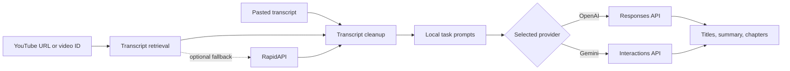

# YouTube Enhance

YouTube Enhance is a Windows desktop application that turns a YouTube transcript into ready-to-use publishing material:

- Five descriptive video titles
- A concise two-paragraph summary with eight hashtags
- Fifteen to twenty-five timestamped chapters

The application sends the included task prompts and transcript directly to OpenAI or Google Gemini. It does not require Fabric, the Fabric command-line tool, or the DigitalGods `/run` service.

## Table of contents

- [What the app does](#what-the-app-does)
- [Features](#features)
- [How it works](#how-it-works)
- [Requirements](#requirements)
- [Quick start](#quick-start)
- [API keys and settings](#api-keys-and-settings)
- [Using the application](#using-the-application)
- [Prompt customization](#prompt-customization)
- [Transcript retrieval](#transcript-retrieval)
- [Project structure](#project-structure)
- [Development and testing](#development-and-testing)
- [Building the Windows executable](#building-the-windows-executable)
- [Privacy and security](#privacy-and-security)
- [Troubleshooting](#troubleshooting)
- [Design note](#design-note)
- [License](#license)

## What the app does

YouTube Enhance runs three focused analysis tasks against the same transcript. Each task has its own local system prompt:

| Task | Output | Prompt directory |
| --- | --- | --- |
| Titles | Exactly five natural, descriptive title ideas | `create_video_titles/` |
| Summary | Two short paragraphs followed by eight hashtags | `create_video_summary/` |
| Chapters | Timestamped chapters in `HH:MM:SS Title` format | `create_video_chapters/` |

All three tasks run independently. If one request fails, successful results from the other tasks remain available. Each result can also be regenerated without rerunning the full analysis.

## Features

- Direct prompting through the OpenAI Responses API or Gemini Interactions API
- Curated model choices for quick startup
- Optional live model discovery using the configured provider keys
- YouTube URL, Shorts URL, share URL, embed URL, or raw video ID input
- Automatic transcript retrieval through `youtube-transcript-api`
- Optional RapidAPI fallback when direct transcript retrieval fails
- Manual transcript input when a transcript is already available
- Duplicate transcript-line filtering and normalized timestamp ranges
- In-memory transcript caching during the current session
- Separate regenerate and copy controls for titles, summary, and chapters
- Paste and clear controls for the URL field
- Paste, copy, and clear controls for the transcript field
- Right-click cut, copy, paste, select-all, and clear menus in text-entry areas
- Dark, light, and system themes
- A top-level **Clear All** action that restores the startup workspace while preserving saved settings
- Per-user settings storage with Windows DPAPI protection for API keys
- Redacted provider error messages so API keys are not displayed in the status bar or written to the log

## How it works



For each task, YouTube Enhance loads `system.md` and the optional `user.md` from that task's prompt directory. The system prompt is sent as provider instructions, while the user prompt and transcript are combined as the model input. Requests use `store: false`.

## Requirements

To run from source:

- Windows 10 or Windows 11 recommended
- Python 3.11 or newer
- Internet access for transcript retrieval and model requests
- An OpenAI API key, a Gemini API key, or both
- A RapidAPI key only if the optional transcript fallback is wanted

The graphical interface uses CustomTkinter. Runtime dependencies are listed in `requirements.txt`.

## Quick start

Clone the repository and enter the project directory:

```powershell
git clone https://github.com/Digitalgods2/ytenhance.git
Set-Location ytenhance
```

Create and activate a virtual environment:

```powershell
py -3.11 -m venv .venv
.\.venv\Scripts\Activate.ps1
```

Install dependencies and start the app:

```powershell
python -m pip install --upgrade pip
python -m pip install -r requirements.txt
python youtube_enhance.py
```

On first launch, open **Settings** and add at least one model-provider API key.

## API keys and settings

Open **Settings** from the top toolbar to configure:

| Setting | Required | Purpose |
| --- | --- | --- |
| OpenAI API key | For OpenAI models | Generates results through the OpenAI Responses API |
| Gemini API key | For Gemini models | Generates results through the Gemini Interactions API |
| RapidAPI key | Optional | Provides a fallback transcript service |

Text fields in the Settings window support the standard keyboard shortcuts and a right-click context menu, including paste.

### Where settings are stored

On Windows, settings are stored for the signed-in user at:

```text
%LOCALAPPDATA%\YouTubeEnhance\settings.json
```

The application log is stored in the same directory:

```text
%LOCALAPPDATA%\YouTubeEnhance\youtube_enhance.log
```

API keys are encrypted before being written to disk with Windows Data Protection API (DPAPI). They can normally be decrypted only by the same Windows user account on the same computer. The selected model is stored alongside the encrypted values.

If a saved key is blank, the application checks these process environment variables as fallbacks:

- `OPENAI_API_KEY`
- `GEMINI_API_KEY`
- `RAPIDAPI_KEY`

Environment values are used at runtime; they are not copied into the repository. The `.gitignore` excludes `.env` and `.env.*` files.

## Using the application

1. Open **Settings** and save the API keys for the providers you want to use.
2. Select an OpenAI or Gemini model from the model menu.
3. Paste a YouTube URL or video ID into the URL field.
4. Optionally paste a transcript into the transcript box. A pasted transcript takes precedence over automatic retrieval.
5. Select **Analyze**.
6. Review the generated titles, summary, and chapters.
7. Use **Copy** to place a result on the clipboard or **Regen** to rerun only that task.

### Model selection

The default menu contains a short curated list so the interface can start without making a provider request. Enable **Load full model list** to query the model-list endpoints using the saved keys. Models unsuitable for text generation, such as audio, embedding, image, and moderation models, are filtered from the list.

Model access depends on the provider account and may differ between API keys. A model appearing in a live list does not guarantee that the account has quota for a generation request.

### Clear controls

- **Clear** beside the URL field removes only the current URL or video ID.
- **Clear** beside the transcript removes only the transcript text.
- **Clear All** returns the main workspace to its initial state, clears current outputs and the session transcript cache, restores the default theme, and cancels the display of results from an older in-flight run. Saved API keys are preserved.

## Prompt customization

The direct prompts live in three directories at the repository root:

```text
create_video_titles/
create_video_summary/
create_video_chapters/
```

Each directory can contain:

- `system.md`: required provider instructions for the task
- `user.md`: optional text placed immediately before the transcript

Edit these Markdown files to change formatting, tone, constraints, or output structure. Keep the prompt directories beside the Python files when running from source. PyInstaller bundles them into the Windows executable according to `youtube_enhance.spec`.

Prompt loading is intentionally local and deterministic: YouTube Enhance does not download prompts or invoke Fabric patterns at runtime.

## Transcript retrieval

When no manual transcript is present, the application:

1. Extracts the video ID from the supplied value.
2. Requests an English transcript through `youtube-transcript-api`.
3. Tries the first available transcript language if English is unavailable.
4. Formats transcript entries as timestamp ranges.
5. If direct retrieval fails and a RapidAPI key is configured, requests the optional fallback service.

The transcript is cached in memory by video ID for the rest of the current app session. It is not written to the settings file. **Clear All** or closing the application removes that cache.

Automatic retrieval can fail when captions are disabled, a video is private or age-restricted, YouTube blocks the request, or the video is not available in the current region. In those cases, paste a transcript manually.

## Project structure

```text
ytenhance/
|-- .github/workflows/secret-scan.yml  Secret scanning for pushes and pull requests
|-- AGENTS.md                     Contributor and repository guidance
|-- app_config.py                 Per-user settings and DPAPI protection
|-- model_clients.py              OpenAI and Gemini HTTP clients
|-- prompt_loader.py              Local task-prompt loading
|-- transcripts.py                Video ID parsing and transcript retrieval
|-- youtube_enhance.py            CustomTkinter application and UI workflow
|-- youtube_enhance.spec          PyInstaller build definition
|-- requirements.txt              Runtime and build dependencies
|-- create_video_titles/          Title-generation prompt
|-- create_video_summary/         Summary-generation prompt
|-- create_video_chapters/        Chapter-generation prompt
`-- tests/
    `-- test_core.py               Offline configuration, prompt, transcript, and UI tests
```

Generated `build/`, `dist/`, cache, log, virtual-environment, and local environment files are excluded from version control.

## Development and testing

Install dependencies in an isolated environment:

```powershell
py -3.11 -m venv .venv
.\.venv\Scripts\Activate.ps1
python -m pip install -r requirements.txt
```

Run the complete test suite:

```powershell
python -m unittest discover -s tests -v
```

The tests are offline. They exercise settings persistence, secret protection, prompt assembly, model-response parsing, video ID extraction, transcript formatting and deduplication, API-key redaction, paste/clear behavior, context menus, and the full **Clear All** reset. They do not send requests to OpenAI, Gemini, YouTube, or RapidAPI.

Run the lightweight application self-test without opening the full interface:

```powershell
python youtube_enhance.py --self-test
```

Every push and pull request also runs Gitleaks against the complete Git history. If Gitleaks is installed locally, run the same type of check before publishing:

```powershell
gitleaks git --redact .
```

## Building the Windows executable

Install the dependencies and run PyInstaller with the checked-in specification:

```powershell
python -m pip install -r requirements.txt
pyinstaller --clean youtube_enhance.spec
```

The standalone executable is written to:

```text
dist\YouTubeEnhance.exe
```

The specification bundles all three prompt directories and includes the transcript library's hidden import. Build output is deliberately not committed; create a fresh executable from the tagged source when distributing a release.

The packaged executable also supports the self-test:

```powershell
$env:YOUTUBE_ENHANCE_SELF_TEST = "1"
.\dist\YouTubeEnhance.exe
Remove-Item Env:YOUTUBE_ENHANCE_SELF_TEST
```

## Privacy and security

- No API keys are embedded in source code or the executable.
- Saved keys use Windows DPAPI protection tied to the local Windows user.
- Provider requests set `store: false`.
- Provider error details are sanitized for recognizable OpenAI and Gemini key formats before display or logging.
- Transcripts and generated results are held in memory and are not added to the settings file.
- Requests necessarily send prompt text and the transcript to the selected model provider. Review the provider's data and privacy terms before analyzing sensitive material.
- The optional RapidAPI fallback sends the YouTube video ID, not a manually pasted transcript, to the configured transcript endpoint.
- Gitleaks scans every push and pull request for committed credentials and other secret patterns.

Do not commit settings files, `.env` files, API keys, or logs. If a key is ever exposed, revoke it at the provider and issue a replacement.

Before publishing changes, inspect `git status --short` and `git diff --cached`. Remember that commit author names and email addresses are public Git metadata; configure a GitHub noreply email if you do not want to publish a personal address. `.gitignore` is only a safeguard, not a substitute for reviewing staged files. If a real secret reaches Git history, rotate it immediately; deleting it in a later commit does not remove the original value from history.

## Troubleshooting

### The provider returns HTTP 401

The saved key is invalid, expired, revoked, or belongs to the wrong provider. Open **Settings**, clear the affected field, paste the replacement key, save, and try again. OpenAI keys belong in the OpenAI field; Google AI Studio or Gemini API keys belong in the Gemini field.

### Paste does not work with a right-click

Use the visible **Paste** button or the text field's context menu. `Ctrl+V` is also supported. In the API-key fields, right-click directly inside the entry area.

### No transcript is available

Confirm the URL or video ID and verify that the video has captions. If direct retrieval remains unavailable, either configure a RapidAPI key for fallback retrieval or paste a transcript into the transcript box.

### A model fails but other output succeeds

The three tasks are separate API requests. The status line identifies the failed task while retaining successful output. Verify provider access and quota, then use **Regen** for only the failed section.

### The full model list cannot load

At least one provider key must be saved. A provider may also reject model-list requests because of authentication, network, or account restrictions. Disable **Load full model list** to return to the built-in choices.

### Where to find diagnostic information

Review the per-user log at:

```text
%LOCALAPPDATA%\YouTubeEnhance\youtube_enhance.log
```

The log records workflow and error information but intentionally does not log configured API-key values.

## Design note

YouTube Enhance preserves the original three-task YouTube analysis workflow while replacing Fabric queries with direct, provider-native prompting. The prompt files remain separate and editable, making the generation behavior transparent and easy to adapt without changing the application code.

## License

MIT License

Copyright (c) 2026 Digitalgods2

Permission is hereby granted, free of charge, to any person obtaining a copy
of this software and associated documentation files (the "Software"), to deal
in the Software without restriction, including without limitation the rights
to use, copy, modify, merge, publish, distribute, sublicense, and/or sell
copies of the Software, and to permit persons to whom the Software is
furnished to do so, subject to the following conditions:

The above copyright notice and this permission notice shall be included in all
copies or substantial portions of the Software.

THE SOFTWARE IS PROVIDED "AS IS", WITHOUT WARRANTY OF ANY KIND, EXPRESS OR
IMPLIED, INCLUDING BUT NOT LIMITED TO THE WARRANTIES OF MERCHANTABILITY,
FITNESS FOR A PARTICULAR PURPOSE AND NONINFRINGEMENT. IN NO EVENT SHALL THE
AUTHORS OR COPYRIGHT HOLDERS BE LIABLE FOR ANY CLAIM, DAMAGES OR OTHER
LIABILITY, WHETHER IN AN ACTION OF CONTRACT, TORT OR OTHERWISE, ARISING FROM,
OUT OF OR IN CONNECTION WITH THE SOFTWARE OR THE USE OR OTHER DEALINGS IN THE
SOFTWARE.
